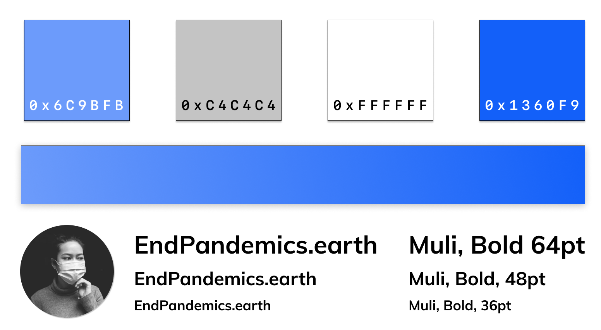

# End Pandemics - Brand

This repository contains brand assets for press, alliance, and campaign partners for distribution across social and broadcast channels.

## PRIMARY MESSAGE

### English
Join our movement to EndPandemics by ending commercial trade in wild animals and regenerating nature.

### Chinese (Traditional)

斷絕全球流行疫症傳播
野生動物棲息廣闊山河
立即終止貿易擴闊生境
保持距離防止疫症再臨

## Chinese (Simplified)

断绝全球流行疫症传播
野生动物栖息广阔山河
立即终止贸易扩阔生境
保持距离防止疫症再临

## SECONDARY MESSAGE

We are a dynamic, global alliance of organizations—representing conservation, finance, security, agroforestry, business, technology, and communications—who are launching the EndPandemics global campaign to address the root cause of all zoonotic outbreaks—rampant commercial wildlife trade and the destruction of nature. Join us.

## WEBSITE LINK

https://endpandemics.earth

## HASHTAGS

Primary: #EndPandemics.Earth #EndPandemics

## SOCIAL CHANNELS

[Youtube](https://www.youtube.com/channel/UCOX-n2Br_5LxOSi5mhYYeUA)
[Twitter](https://twitter.com/endpandemics)

## VIDEOS

- [CNN Spot #2, Nov 2020](https://youtu.be/cpRT32lcHRM)
- [CNN Spot #1, Nov 2020](https://youtu.be/-rVD9dkT-yc)
- [Original 3 min Spot](https://youtu.be/akPJaVaovzo)
- [Contribute Translations](http://tiny.cc/ep-translatevideo)

## ALLIANCE MEMBER TOOLS

- https://endpandemics.earth/tools

## MEDIA
Please refer to the following image for font, swatch, and gradient use. The forest still is for general background use.

- Font: Helvetica Neue, Bold [download](media/Muli.zip) 

# Questions & Support

Have a support request or seeking something different?
[Reach out to supper](mailto:support@endpandemics.earth)

https://www.endpandemics.earth

# Revision History

- 20.11.2020 - added new branding materials
- 23.04.2020 - updated material
- 21.04.2020 – added earthday materials
- 06.04.2020 - added draft flyer and images
- 20.05.2020 - added background, updated photo credit, added font

# Photo Credits

- Tobias Tullius
